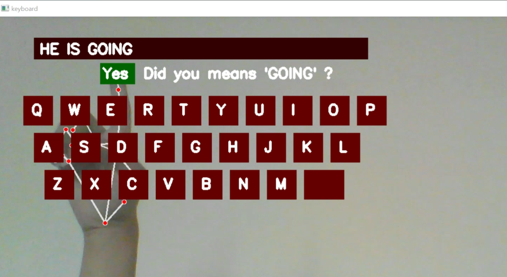

# Virtual AI Keyboard with Gesture Typing & Spell Correction

This is a **Virtual Keyboard using Hand Gestures** built with **OpenCV**, **MediaPipe**, and **Python**. It allows users to type words using hand movements, recognizes spelling errors in real time, and suggests corrections interactively.




## Features

- **Gesture-Based Typing**: Type letters by hovering and "clicking" with specific finger gestures.
- **On-Screen Virtual Keyboard**: A full interactive keyboard rendered live on camera.
- **Smart Spell Checker**: Auto-checks spelling of last typed word when you hit space.
- **Suggestion Interaction**: Suggests the correct word and lets you replace it with a gesture-based "Yes" button.
- **Real-Time Feedback**: Highlights buttons when hovered/clicked.
-   Designed to work with just a webcam!


---

## Technologies Used

- **OpenCV** – For webcam input and drawing on the screen.
- **MediaPipe Hands** – For detecting hand landmarks and gestures.
- **Python** – Main programming language.
- **pyspellchecker** – For typo correction and suggestion logic.

## Demo Video

[Watch Demo on LinkedIn](https://www.linkedin.com/posts/afiamaham_virtualkeyboard-computervision-python-activity-7319639677383204864-G_yY?utm_source=share&utm_medium=member_desktop&rcm=ACoAAEXH7xcBZoknbY78H8JLJvJmg3-ahY1cNtw)

---

## Installation

1. Clone the repository:
   ```bash
   https://github.com/AfiaMaham/Hand-Gesture-Keyboard-AI.git
